# 🎮 Spirit Hands Adventure

<p align="center">
  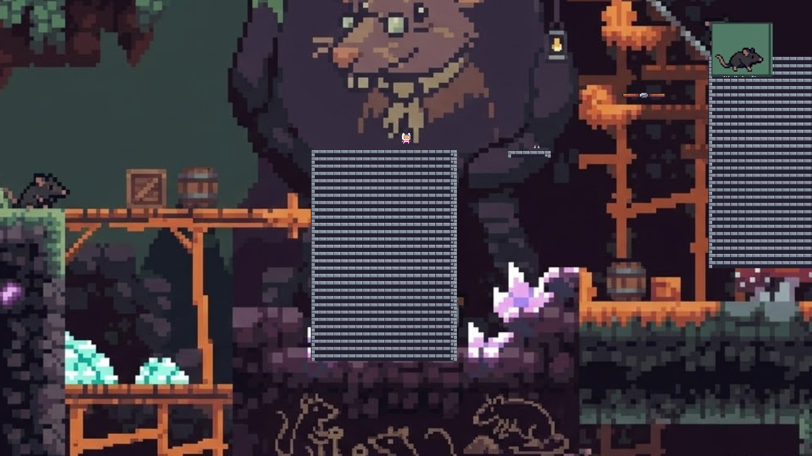
</p>

<p align="center">
  <b>A 2D Pixel Art Platformer Controlled by Hand Gestures</b><br>
  <i>Built with Unity + MediaPipe Real-time Gesture Recognition</i>
</p>

<p align="center">
  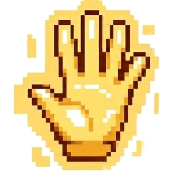
  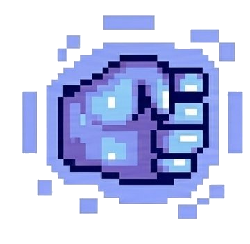
  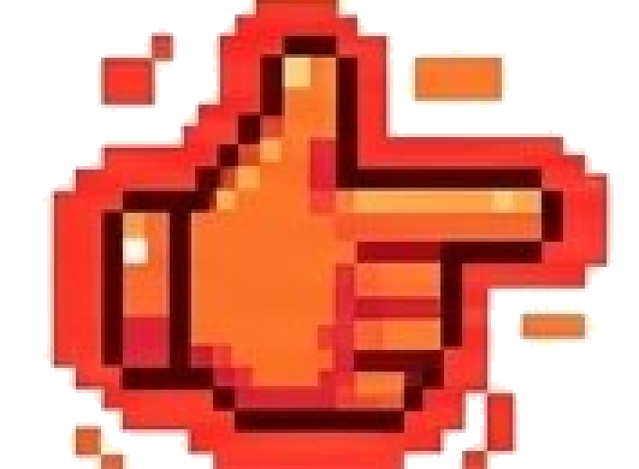
</p>

---

## ✨ Overview

**Spirit Hands Adventure** is a 2D side-scrolling platformer that breaks the traditional keyboard-and-mouse control paradigm. Players navigate through beautifully crafted pixel-art levels using **real-time hand gesture recognition** powered by Google's MediaPipe.

No controller needed—just your hands and a webcam!

<p align="center">
  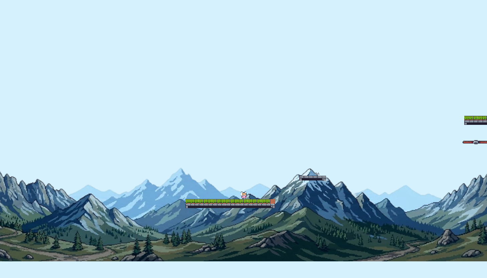
</p>

---

## 🎯 Key Features

### 🤚 Gesture-Based Gameplay
Control the entire game with natural hand gestures:

| Gesture | Icon | Action |
|---------|------|--------|
| **Open Palm** |  | Push boxes, free movement |
| **Fist** |  | Pull boxes, locked facing direction |
| **Finger Gun** |  | Shoot projectiles at enemies |
| **Dual-hand: Push + Fist** | 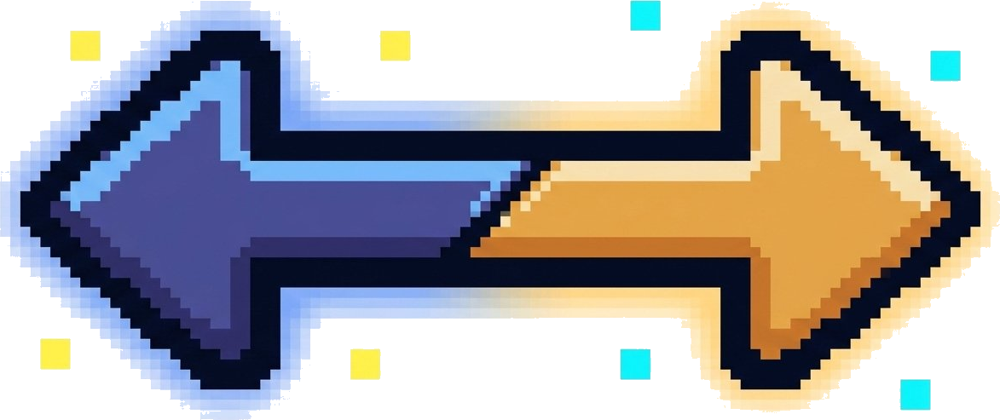 | Mirror teleport (Switch) |
| **Dual-hand: Double Fist** | 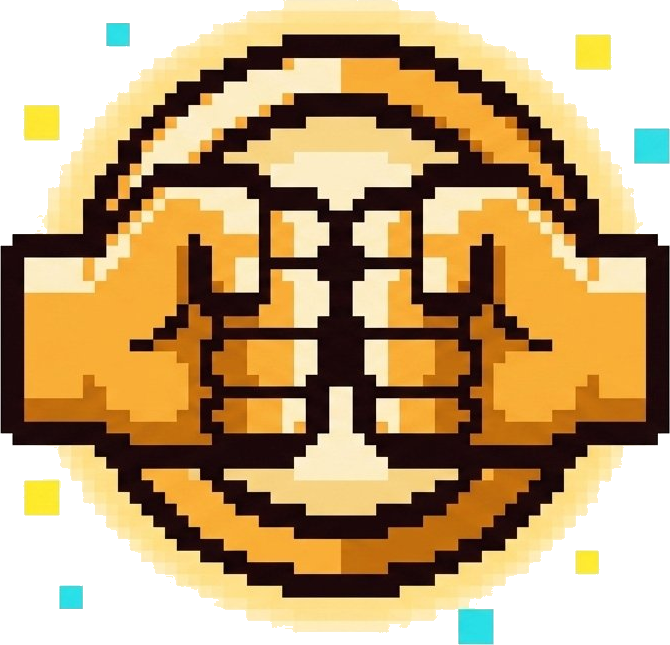 | Invulnerable body (Golden Shield) |

<p align="center">
  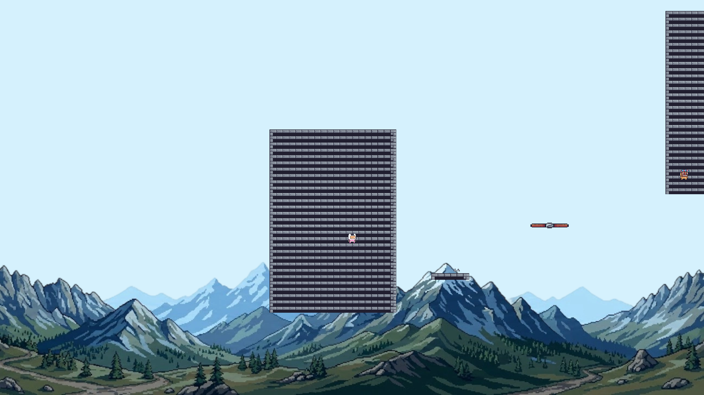
</p>

### 🪞 Mirror Teleportation System
Stand near a magical mirror, perform the **Switch gesture** (one hand Push + one hand Fist), and instantly swap to the mirrored position. A visual clone shows exactly where you'll land.

<p align="center">
  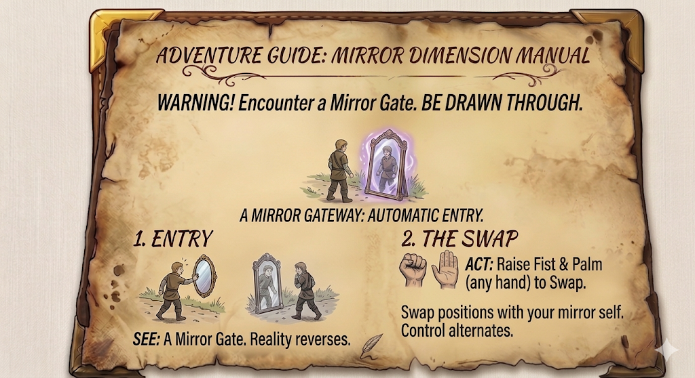
</p>

### 🌑 Dynamic Dark Vision
Explore pitch-black cave sections with a limited field of view. A custom shader creates a realistic darkness effect where only the area around the player is visible.

<p align="center">
  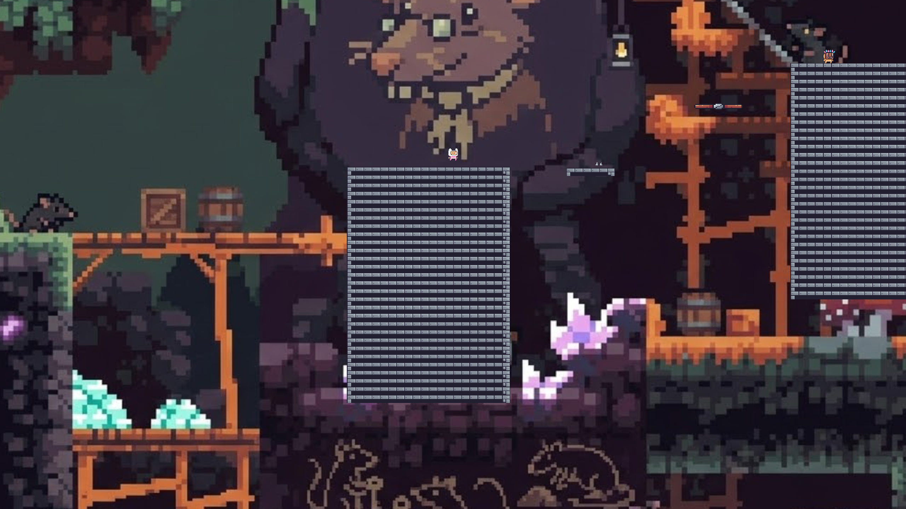
</p>

### 📦 Physics-Based Box Pushing/Pulling
Interact with the environment using gestures:
- **Push** (Open Palm): Walk into boxes to push them forward
- **Pull** (Fist): Grab and drag boxes behind you, with facing direction locked

<p align="center">
  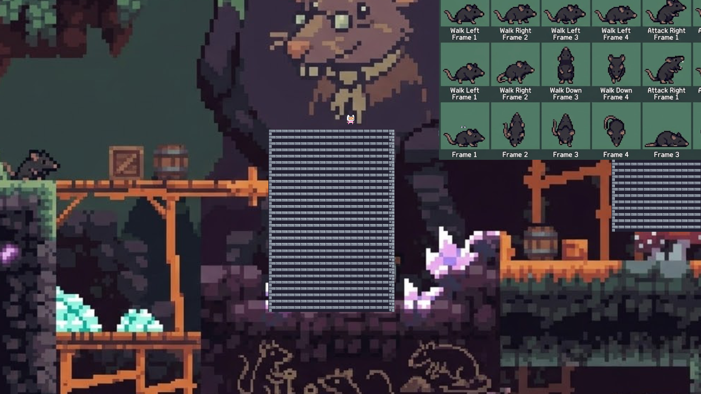
</p>

---

## 🎮 Game Mechanics

### Basic Controls

<p align="center">
  
</p>

- **A / D** — Move left / right
- **SPACE** — Jump (press again in mid-air for **Double Jump**)
- **Hand Gestures** — Activate special abilities

### Combat System

<p align="center">
  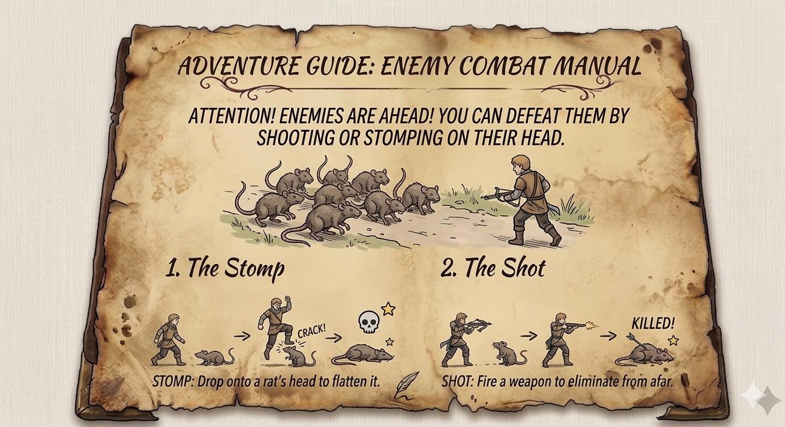
</p>

Enemies (rats) can be defeated in two ways:
1. **Stomp** — Jump on their heads from above
2. **Shoot** — Use the Finger Gun gesture to fire projectiles

### Checkpoint System

<p align="center">
  
</p>

Golden checkpoints save your progress. The game features a robust **snapshot save system** that captures the entire game state—including enemy positions, box locations, and player status—to JSON files.

---

## 🧠 Advanced Technology

### 🔮 Real-time Gesture Recognition Pipeline

```
Webcam → MediaPipe (21 hand landmarks) 
  → GestureClassifier (confidence scoring)
    → GestureEvents (game actions)
```

- **21 landmark hand tracking** via MediaPipe
- **Custom classification algorithms** for each gesture type
- **Dual-hand combo detection** for advanced abilities
- **Camera occlusion detection** to handle blocked lenses
- **Cross-scene persistence** — gesture service survives level transitions

### 🎨 Custom Shader: DarkVisionMask

A bespoke Unity shader implements the darkness effect:
- Radial visibility mask centered on the player
- Configurable radius and edge softness
- Smooth fade transitions
- Runs on a fullscreen overlay at sorting order 5000

### 💾 Snapshot Save Architecture

The game uses a sophisticated serialization system:
- **ISnapshotSaveable** interface for any component that needs saving
- **Automatic rigidbody state capture** (position, velocity, rotation)
- **Component-level JSON serialization**
- **Session snapshots** (temporary) and **Checkpoint snapshots** (permanent)
- **Scene-crossing restoration** with path-based object lookup

### 🏗️ Editor Automation Tools

Over **15 custom Editor tools** streamline level design:

| Tool | Purpose |
|------|---------|
| `Setup PinkMan Animations` | Auto-build animation clips & controller |
| `Setup Level1 Scene` | Wire player, camera, GameManager refs |
| `Build Terrain Visuals` | Rebuild ground from tile sprites |
| `Setup Cave Tilemap` | Create grid + tilemap + colliders |
| `Rebuild Cave Ground` | 20×30 tile grid with cave sprites |
| `Setup Background` | Parallax mountain background prefab |
| `Setup Phase3 Objects` | Place spikes, saws, platforms, enemies |

---

## 🖼️ Screenshot Gallery

<p align="center">
  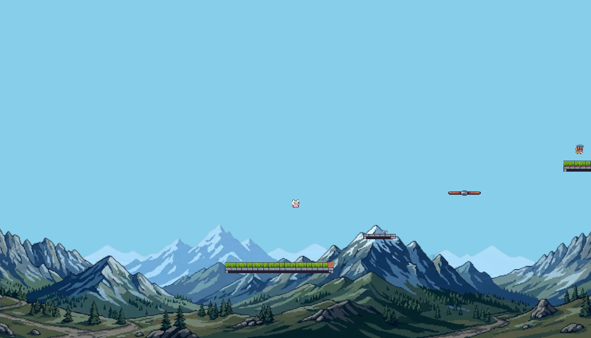
  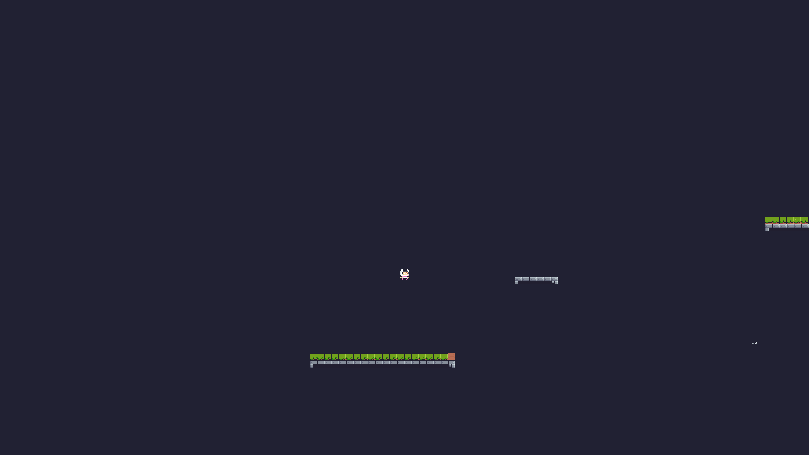
</p>

<p align="center">
  
  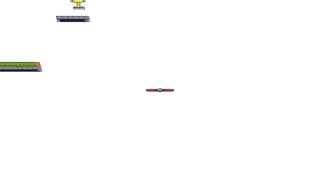
</p>

<p align="center">
  
  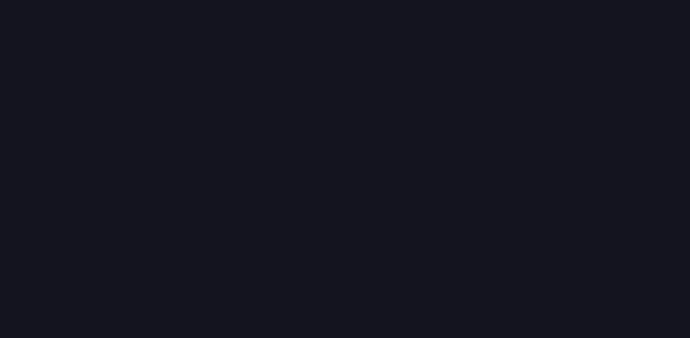
</p>

---

## 🛠️ Tech Stack

| Layer | Technology |
|-------|-----------|
| **Engine** | Unity 2022.3.62f3 (Built-in Render Pipeline) |
| **Language** | C# |
| **Gesture Recognition** | Google MediaPipe (homuler Unity Plugin) |
| **Asset Packs** | Pixel Adventure 1, Cave Assets |
| **Graphics** | Sprite-based 2D, Custom Shader (DarkVisionMask) |
| **Physics** | Unity 2D Physics (Rigidbody2D) |
| **Serialization** | Unity JsonUtility + Custom Snapshot System |
| **Testing** | Unity Test Runner (EditMode + PlayMode) |

---

## 🚀 Quick Start

### Prerequisites
- Unity 2022.3.62f3 or later
- Webcam (for gesture recognition)
- Windows / macOS / Linux

### Setup

1. **Clone the repository**
   ```bash
   git clone https://github.com/Hanson-6/COMP3329.git
   cd COMP3329
   ```

2. **Install MediaPipe package**
   ```powershell
   ./setup-mediapipe.ps1
   ```
   This downloads `com.github.homuler.mediapipe-0.16.3.tgz` to `Packages/`.

3. **Open in Unity**
   - Open Unity Hub
   - Add project from the cloned folder
   - Open with Unity 2022.3.62f3

4. **Run the game**
   - Open `Assets/Scenes/MainMenu.unity`
   - Press Play
   - Allow webcam access when prompted

### Scene Build Order

| Index | Scene | Description |
|-------|-------|-------------|
| 0 | `MainMenu` | Title screen with Start / Continue / Quit |
| 1 | `Tutorial` | Gesture tutorial and practice area |
| 2 | `LevelComplete` | Level completion screen |

---

## 📁 Project Structure

```
COMP3329/
├── Assets/
│   ├── Animations/           # Player animation clips
│   ├── CaveAssets/           # Cave tilesets & sprites
│   ├── Editor/               # Custom Editor tools (15+)
│   ├── Pixel Adventure 1/    # Main character & environment sprites
│   ├── Prefabs/              # Reusable game objects
│   ├── Resources/            # Gesture config & sprites
│   ├── Scenes/               # Game scenes
│   │   ├── MainMenu.unity
│   │   ├── Tutorial.unity
│   │   └── LevelComplete.unity
│   ├── Scripts/
│   │   ├── Core/             # GameManager, SaveManager, GameData
│   │   ├── Enemy/            # Enemy AI & patrol logic
│   │   ├── Environment/      # Mirror, Checkpoint, Traps, Platforms
│   │   ├── GestureRecognition/ # Full gesture pipeline
│   │   │   ├── Core/         # GestureType, GestureEvents, GestureResult
│   │   │   ├── Detection/    # MediaPipeBridge, GestureClassifier, HandTracker
│   │   │   ├── Service/      # GestureService (singleton facade)
│   │   │   └── UI/           # GestureDisplayPanel, GestureOverlay
│   │   ├── Input/            # GestureInputBridge, InvulnerableBodyController
│   │   ├── Player/           # PlayerController, SpiritHandDisplay, ShootingController
│   │   └── UI/               # PauseMenu, DarkVisionController, EndPoint
│   ├── Shaders/              # Custom DarkVisionMask shader
│   ├── Snapshots/            # Runtime save files (ignored by git)
│   └── Textures/             # UI buttons, Spirit Hand icons
├── Docs/
│   ├── MEDIAPIPE_TEAM_SETUP.md
│   └── CLAUDE.md             # Architecture documentation
├── Packages/
│   └── manifest.json         # Dependencies (includes MediaPipe)
└── ProjectSettings/          # Unity project configuration
```

---

## 🧪 Testing

The project includes comprehensive tests using Unity Test Runner:

- **EditMode Tests** (`Assets/Tests/EditMode/`)
  - `GestureClassifierTests` — Pure math tests for gesture classification
  
- **PlayMode Tests** (`Assets/Tests/PlayMode/`)
  - `GestureIntegrationTests` — End-to-end gesture pipeline tests

Run tests via **Window > General > Test Runner** in Unity Editor.

---

## 🎨 Art & Design

- **Pixel Art Style**: Classic 16-bit retro aesthetics
- **Character**: "Pink Man" from Pixel Adventure 1 asset pack
- **Environments**: Mixed outdoor (mountain) and underground (cave) themes
- **UI Design**: Hand-drawn parchment-style tutorial guides
- **Visual Feedback**: 
  - Spirit hands pulse above the player when gestures are detected
  - Golden tint effect during invulnerable body state
  - Smooth parallax scrolling backgrounds

---

## 🤝 Contributing

This is a course project for COMP3329 at HKU. The repository uses a main-branch workflow:

```bash
# Pull latest changes
git pull origin main

# Make your changes, then commit and push
git add .
git commit -m "feat: your feature description"
git push origin main
```

**Important**: Generated snapshot files in `Assets/Snapshots/` should not be committed (already in `.gitignore`).

---

## 📝 License

This project is developed for educational purposes as part of the COMP3329 course at The University of Hong Kong.

Asset packs used:
- **Pixel Adventure 1** — by Pixel Frog ( itch.io )
- **Cave Assets** — Custom / Third-party pixel art assets

---

## 🙏 Acknowledgments

- **Google MediaPipe** — For the incredible hand tracking ML model
- **homuler** — For the MediaPipe Unity Plugin
- **Pixel Frog** — For the beautiful Pixel Adventure asset pack
- **Unity Technologies** — For the game engine

---

<p align="center">
  <i>Made with ❤️ and 🤚 by the COMP3329 Team</i><br>
  <i>The University of Hong Kong</i>
</p>

<p align="center">
  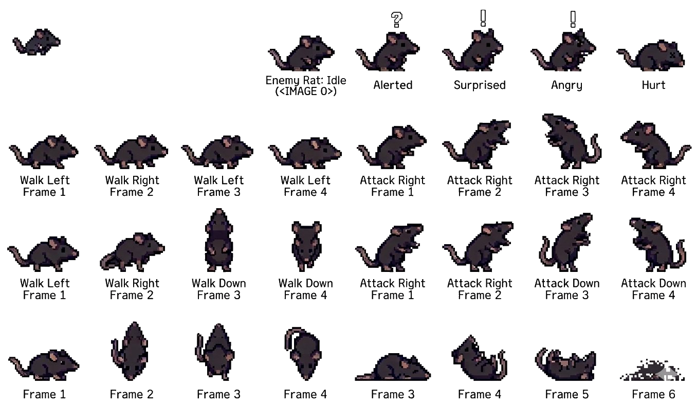
</p>
