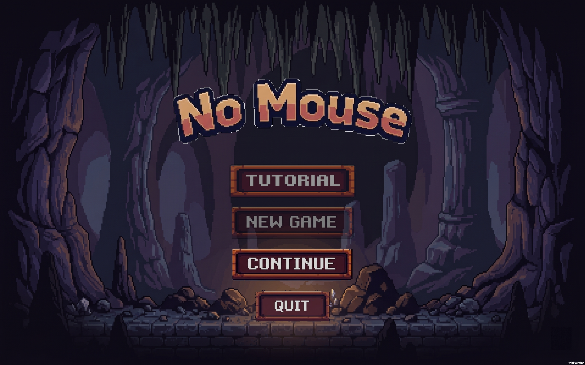
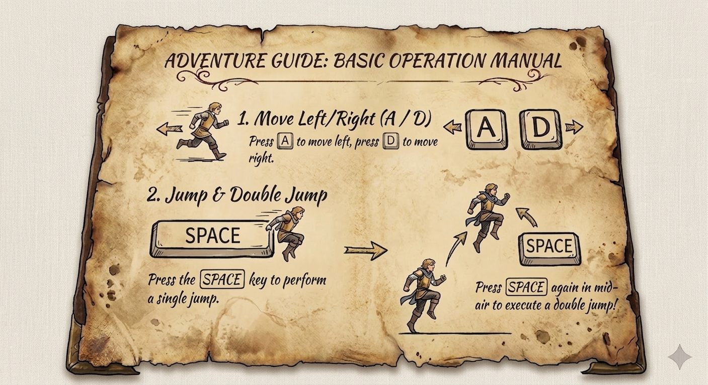

# 🎮 No Mouse

<p align="center">
  <b>A 2D Pixel Art Platformer Controlled by Hand Gestures</b><br>
  <i>Built with Unity + MediaPipe Real-time Gesture Recognition</i>
</p>

<p align="center">
  
  
  
</p>

---

## ✨ Overview

**Spirit Hands Adventure** is a 2D side-scrolling platformer that breaks the traditional keyboard-and-mouse control paradigm. Players navigate through beautifully crafted pixel-art levels using **real-time hand gesture recognition** powered by MediaPipe.

No mouse needed—just your hands and a webcam!

---

## <font color="red">⚠️ Important Notice</font>

> <font color="red">**Webcam Required for Gameplay**</font>
>
> <font color="red">This game relies on real-time hand gesture recognition via your webcam. **If camera access is not granted or no webcam is detected**, the game screen will freeze on a static image and gesture controls will be non-functional.</font>
>
> <font color="red">Please ensure:</font>
>
> - <font color="red">A working webcam is connected before launching the game</font>
> - <font color="red">Camera permissions are granted when prompted by the OS or browser</font>
> - <font color="red">No other application is exclusively occupying the webcam</font>

<p align="center">
  
</p>

## 🎯 Key Features

### 🤚 Gesture-Based Gameplay
Control the entire game with natural hand gestures:

| Gesture | Icon | Action |
|---------|------|--------|
| **Open Palm** |  | Push boxes |
| **Fist** |  | Pull boxes |
| **Finger Gun** |  | Shoot projectiles at enemies |
| **Dual-hand: Push + Fist** |  | Mirror teleport (Switch) |
| **Dual-hand: Double Fist** |  | Invulnerable body (Golden Shield) |

---

## 🎮 Game Mechanics

### Basic Controls

<p align="center">
  
</p>

- **A / D** — Move left / right
- **SPACE** — Jump (press again in mid-air for **Double Jump**)
- **Hand Gestures** — Activate special abilities

### Combat System

<p align="center">
  
</p>

Enemies (rats) can be defeated in two ways:
1. **Stomp** — Jump on their heads from above
2. **Shoot** — Use the Finger Gun gesture to fire projectiles

### Checkpoint System

<p align="center">
  
</p>

Golden checkpoints save your progress. The game features a robust **snapshot save system** that captures the entire game state—including enemy positions, box locations, and player status—to JSON files.

---

## 🧠 Advanced Technology

### 🔮 Real-time Gesture Recognition Pipeline

```
Webcam → MediaPipe (21 hand landmarks) 
  → GestureClassifier (confidence scoring)
    → GestureEvents (game actions)
```

- **21 landmark hand tracking** via MediaPipe
- **Custom classification algorithms** for each gesture type
- **Dual-hand combo detection** for advanced abilities
- **Camera occlusion detection** to handle blocked lenses
- **Cross-scene persistence** — gesture service survives level transitions

### 💾 Snapshot Save Architecture

The game uses a sophisticated serialization system:
- **ISnapshotSaveable** interface for any component that needs saving
- **Automatic rigidbody state capture** (position, velocity, rotation)
- **Component-level JSON serialization**
- **Session snapshots** (temporary) and **Checkpoint snapshots** (permanent)
- **Scene-crossing restoration** with path-based object lookup

### 🏗️ Editor Automation Tools

Over **15 custom Editor tools** streamline level design:

| Tool | Purpose |
|------|---------|
| `Setup PinkMan Animations` | Auto-build animation clips & controller |
| `Setup Level2 from Level1` | Wire player, camera, GameManager refs |
| `Setup Cave Tilemap Prefab` | Create grid + tilemap + colliders |
| `Rebuild Cave Ground` | 20x30 tile grid with cave sprites |
| `Setup Background` | Parallax mountain background prefab |
| `Setup Phase3 Objects` | Place spikes, saws, platforms, enemies |
| `Terrain Painter` | Interactive tile painting in Scene View |

---

## 🛠️ Tech Stack

| Layer | Technology |
|-------|-----------|
| **Engine** | Unity 2022.3.62f3 (Built-in Render Pipeline) |
| **Language** | C# |
| **Gesture Recognition** | MediaPipe (homuler Unity Plugin) |
| **Asset Packs** | Pixel Adventure 1, Cave Assets |
| **Graphics** | Sprite-based 2D, Custom Shader (DarkVisionMask) |
| **Physics** | Unity 2D Physics (Rigidbody2D) |
| **Serialization** | Unity JsonUtility + Custom Snapshot System |
| **Testing** | Unity Test Runner (EditMode + PlayMode) |

---

## 🚀 Quick Start

### Prerequisites
- Unity 2022.3.62f3 or later
- Webcam (for gesture recognition)
- Windows / macOS / Linux

### Setup

1. **Clone the repository**
   ```bash
    git clone https://github.com/Hanson-6/No-Mouse.git
    cd No-Mouse
   ```

2. **Install MediaPipe package**
   ```powershell
   ./setup-mediapipe.ps1
   ```
   This downloads `com.github.homuler.mediapipe-0.16.3.tgz` to `Packages/`.

3. **Open in Unity**
   - Open Unity Hub
   - Add project from the cloned folder
   - Open with Unity 2022.3.62f3

4. **Run the game**
   - Open `Assets/Scenes/MainMenu.unity`
   - Press Play
   - Allow webcam access when prompted

### Scene Build Order

| Index | Scene | Description |
|-------|-------|-------------|
| 0 | `MainMenu` | Title screen with Start / Continue / Quit |
| 1 | `Level 2` | Main game area |
| 2 | `Tutoring` | Gesture tutorial and practice area |
| 3 | `LevelComplete` | Level completion screen |

---

## 📁 Project Structure

```
No-Mouse/
├── Assets/
│   ├── Animations/           # Player animation clips & controllers
│   ├── Audio/                # Sound effects & music
│   │   ├── SFX/              # Laser, PowerUp, Jump, UI, etc.
│   │   ├── Music/            # Background music
│   │   └── Environment/      # Fire, ambient sounds
│   ├── CaveAssets/           # Cave tilesets & sprites
│   ├── Editor/               # Custom Editor tools (24 scripts)
│   ├── IDTK/                 # LDtk level definitions
│   ├── Materials/            # Shared materials
│   ├── Physics/              # Physics materials
│   ├── Pixel Adventure 1/    # Main character & environment sprites
│   ├── Prefabs/              # Reusable game objects
│   ├── Resources/            # Gesture config & runtime sprites
│   ├── Scenes/               # Game scenes
│   │   ├── MainMenu.unity
│   │   ├── Level2.unity
│   │   ├── Tutoring.unity
│   │   ├── Tutorial.unity
│   │   └── LevelComplete.unity
│   ├── Scripts/
│   │   ├── Core/             # GameManager, SaveManager, GameData
│   │   ├── Enemy/            # Enemy AI & patrol logic
│   │   ├── Environment/      # Mirror, Checkpoint, Traps, Platforms
│   │   ├── GestureRecognition/ # Full gesture pipeline
│   │   │   ├── Core/         # GestureType, GestureEvents, GestureResult
│   │   │   ├── Detection/    # MediaPipeBridge, GestureClassifier, HandTracker
│   │   │   ├── Service/      # GestureService (singleton facade)
│   │   │   └── UI/           # GestureDisplayPanel, GestureOverlay
│   │   ├── Input/            # GestureInputBridge, InvulnerableBodyController
│   │   ├── Player/           # PlayerController, SpiritHandDisplay, ShootingController
│   │   ├── Puzzle/           # SwitchDoor, PushableBox, ButtonController
│   │   └── UI/               # PauseMenu, SettlementPanel, EndPoint
│   ├── Shaders/              # Custom DarkVisionMask shader
│   ├── Snapshots/            # Runtime save files (ignored by git)
│   ├── StreamingAssets/      # MediaPipe hand landmarker model
│   ├── Tests/                # EditMode & PlayMode tests
│   ├── Textures/             # Organized by category
│   │   ├── Buttons/          # UI button sprites
│   │   ├── Backgrounds/      # Parallax backgrounds
│   │   ├── Hints/            # Tutorial hint images
│   │   ├── Particles/        # Particle textures
│   │   ├── SpiritHands/      # Hand gesture icons
│   │   ├── Tiles/            # Game tile images
│   │   └── UI/               # General UI textures
│   └── Videos/               # Transition video clips
├── Docs/
│   ├── MEDIAPIPE_TEAM_SETUP.md
│   ├── GESTURE_SERVICE_SOP.md
│   └── SPIRITHAND_SETUP.md
├── Packages/
│   └── manifest.json         # Dependencies (includes MediaPipe)
└── ProjectSettings/          # Unity project configuration
```

---

## 🧪 Testing

The project includes comprehensive tests using Unity Test Runner:

- **EditMode Tests** (`Assets/Tests/EditMode/`)
  - `GestureClassifierTests` — Pure math tests for gesture classification
  
- **PlayMode Tests** (`Assets/Tests/PlayMode/`)
  - `GestureIntegrationTests` — End-to-end gesture pipeline tests

Run tests via **Window > General > Test Runner** in Unity Editor.

---

## 🤝 Contributing

This is a course project for COMP3329 at HKU. The repository uses a main-branch workflow:

```bash
# Pull latest changes
git pull origin main

# Make your changes, then commit and push
git add .
git commit -m "feat: your feature description"
git push origin main
```

**Important**: Generated snapshot files in `Assets/Snapshots/` should not be committed (already in `.gitignore`).

---

## 📝 License

This project is developed for educational purposes as part of the COMP3329 course at The University of Hong Kong.

Asset packs used:
- **Pixel Adventure 1** — by Pixel Frog ( itch.io )
- **Cave Assets** — Custom / Third-party pixel art assets

---

## 🙏 Acknowledgments

- **MediaPipe** — For the incredible hand tracking ML model
- **homuler** — For the MediaPipe Unity Plugin
- **Pixel Frog** — For the beautiful Pixel Adventure asset pack
- **Unity Technologies** — For the game engine

---

<p align="center">
  <i>Made with ❤️ and 🤚 by No Mouse Team</i><br>
  <i>The University of Hong Kong</i>
</p>


<p align="center">
  
</p>
